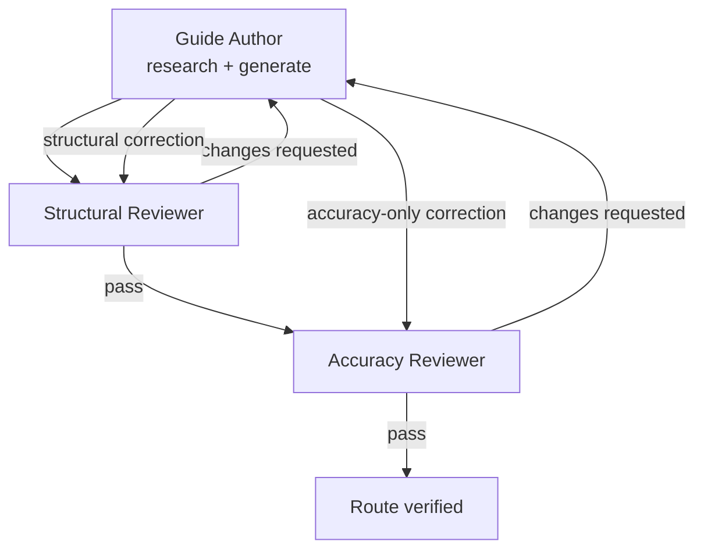

# VN Guide

VN Guide turns Japanese visual-novel walkthroughs into clean, route-by-route guides that are easy to follow while playing.

Each guide is built from multiple Japanese walkthroughs, then independently checked for route flow and source accuracy before it is marked verified.

**Live site:** [kanjieater.github.io/VN-Guide](https://kanjieater.github.io/VN-Guide/)

## For Agents

This README is the entry point for working on the repository.

If you are asked to create, review, correct, or finish a guide, coordinate the full workflow below. Do not invent a separate process and do not stop after generation alone.

### Start here

Read the shared rules first:

- [Guide standards](.claude/guide-standards.md) — canonical rules for sources, target releases, guide structure, review, and completion.
- [Guide review workflow](.claude/workflows/guide-review.md) — lifecycle and handoff rules.

Then use the appropriate role instructions:

- [Guide Author](.claude/agents/guide-author.md) — research, generate routes, and apply reviewer corrections.
- [Structural Reviewer](.claude/agents/guide-reviewer-structural.md) — independently verify that the route can actually be followed from start to finish.
- [Accuracy Reviewer](.claude/agents/guide-reviewer.md) — independently verify the guide against the Japanese walkthrough sources and approve completed routes.

Generation also uses the committed templates in [`scripts/prompts/`](scripts/prompts/), especially [`research.md`](scripts/prompts/research.md) and [`route.md`](scripts/prompts/route.md).

### Workflow

The three roles are independent. Authors do not approve their own work, reviewers do not silently edit guide content, and corrections must be re-reviewed.

A guide is finished only when every route has passed both structural and accuracy review and is marked `reviewed: true`.

### Guide target

Every guide must be tied to an explicit game release/platform. Do not infer the intended version from a VNDB work ID when multiple releases exist.

Use the repository's `guide_target` metadata and verify that the walkthrough sources apply to that release. When possible, link directly to the specific VNDB release (`r...`) rather than only the broader work (`v...`).

For new game registrations, also verify and populate a cover for that exact target edition/platform when one is available. Non-VN linear walkthroughs are opt-in through the game's `prompt_supplement.md`; title-scoped source exceptions, when explicitly approved by the repository owner, must enumerate the exact facts they cover and do not weaken the normal source gate for other facts or games.

### Orchestration

An agent coordinating a guide should carry it through the entire lifecycle:

**research → author → structural review → corrections/re-review → accuracy review → corrections/re-review → verified**

Keep each role's context independent and continue the loop until the repository's completion gates pass.

The Python scripts in [`scripts/`](scripts/) automate this same workflow, but agents that can work directly with the repository do not need to run the local automation to follow the process correctly.
